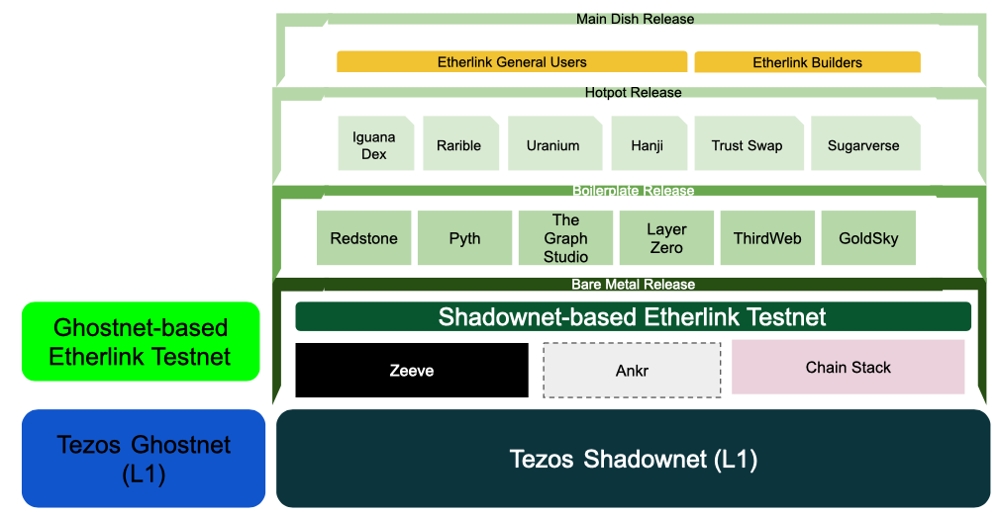

import InlineCopy from '@site/src/components/InlineCopy';

The Etherlink tesnet is being migrated to new Shadownet-based Testnet from the legacy Ghostnet-based Testnet, which will sunset on **15 January 2026**.

This page gives all the details of the migration, including milestones, calls to action, and the current progress.
It is intended for all the Etherlink partners such as infrastructure providers, node operators, and application builders.

## Key information

Here are some important pieces of information for Shadownet Testnet:

- Built on Tezos L1 testnet [Shadownet](https://teztnets.com/shadownet-about)
- Chain ID: 128123
- RPC endpoint: <InlineCopy code="https://node.braeburn.etherlink.com" />
- Block explorer: <a href="https://testnet.explorer.etherlink.com/">https://testnet.explorer.etherlink.com/</a>

For more technical details about this network, see [Network information](/get-started/network-information).

## Rationale

This migration will ensure better testnet parity with the Etherlink mainnet, ensuring a much smoother launch of applications and services in production.

This aims in paving the way for more partners to bring their applications to Etherlink, by concretely ensuring:

- earlier Etherlink Stack requirement forecast;
- better pre-live simulations;
- better overall builder experience.

## Migration steps

The migration is organized around the release of several layers of the Shadownet Testnet, depicted below:

These layers will be delivered in the following steps:

- Bare metal release ✅
  - contains the testnet network and an "empty" EVM
  - ETA: October 2025
- BLockchain infrastructure release
  - includes bridges, tokens, oracles, etc
  - ETA: November 2025
- Hotpot release
  - includes migrated versions of all existing EVM projects
  - ETA: December 2025
- Main dish release
  - completes the migration of builder and testnet user communities
  - ETA: 15 January 2026

## Calls to action

This section is meant for guiding the different categories of partners into action.
 
#### For node operators

TBA

#### For developers

TBA

## Early adopters

TBA

## Getting help

Please reach out to our team on the Tezos Discord https://discord.gg/tezos in channel #TBA  if you have any questions.