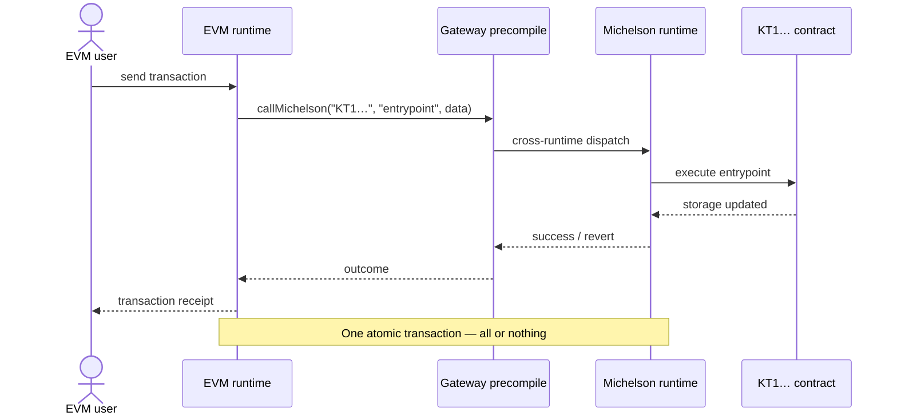

# Etherlink's architecture

## Seamless integration

To enable the seamless integration of the two ecosystems (EVM and Michelson) in a single blockchain, Etherlink<!--TX--> provides **Native Atomic Composability** (sometimes shortened as NAC): smart contracts in one interface can call contracts in the other within a single atomic transaction.
Thanks to the atomic composition combined with the use of the same native token, Etherlink<!--TX--> can be seen as **a unified execution layer**, constituting a single economic space.

Each interface is implemented by a dedicated runtime exposing a standard RPC endpoint.

| Interface | Runtime | RPC standard |
|---|---|---|
| EVM | EVM runtime | Ethereum JSON-RPC |
| Michelson | Michelson runtime | Tezos RPC |

The goal for each interface is to stay as compatible as possible with the original ecosystem it supports — Ethereum for the EVM interface, and Tezos Layer 1 for the Michelson interface. Where differences exist, they are documented in the respective interface sections.

### Bridging vs. NAC

When an EVM contract calls a Michelson contract on Etherlink<!--TX-->, both execution steps happen inside the same rollup kernel, within a single block:

<svg viewBox="0 0 680 470" role="img" aria-label="Etherlink architecture: Ethereum and Tezos developer tools connect to the EVM and Michelson interfaces, each implemented by a runtime of the Etherlink chain; the runtimes are linked by cross-runtime atomic calls (NAC), and the chain is anchored on Tezos Layer 1 as a Smart Rollup" style={{width: '100%', maxWidth: '680px', display: 'block', margin: '1.5rem auto', fontFamily: 'inherit'}}>
  <defs>
    <marker id="arch-arrow-eth" viewBox="0 0 8 8" refX="6" refY="4" markerWidth="7" markerHeight="7" orient="auto-start-reverse">
      <path d="M0,0.6 L7,4 L0,7.4" fill="none" stroke="#38FF9C" strokeWidth="1.6" strokeLinecap="round" strokeLinejoin="round"/>
    </marker>
    <marker id="arch-arrow-tez" viewBox="0 0 8 8" refX="6" refY="4" markerWidth="7" markerHeight="7" orient="auto-start-reverse">
      <path d="M0,0.6 L7,4 L0,7.4" fill="none" stroke="#9DB8FF" strokeWidth="1.6" strokeLinecap="round" strokeLinejoin="round"/>
    </marker>
    <marker id="arch-arrow-w" viewBox="0 0 8 8" refX="6" refY="4" markerWidth="7" markerHeight="7" orient="auto-start-reverse">
      <path d="M0,0.6 L7,4 L0,7.4" fill="none" stroke="rgba(255,255,255,0.7)" strokeWidth="1.6" strokeLinecap="round" strokeLinejoin="round"/>
    </marker>
  </defs>

  {/* Developer tools — Ethereum lane (blue) and Tezos lane (green) */}
  <rect x="20" y="8" width="300" height="76" rx="12" fill="rgba(255,255,255,0.08)"/>
  <line x1="33" y1="9.25" x2="307" y2="9.25" stroke="#38FF9C" strokeWidth="2.5" strokeLinecap="round" opacity="0.85"/>
  <text x="170" y="41" textAnchor="middle" fill="#38FF9C" style={{font: '600 11.5px var(--ifm-font-family-monospace)', letterSpacing: '0.12em'}}>ETHEREUM TOOLS</text>
  <text x="170" y="65" textAnchor="middle" fill="rgba(255,255,255,0.92)" fontSize="14.5">MetaMask &#183; Hardhat &#183; Foundry &#8230;</text>

  <rect x="360" y="8" width="300" height="76" rx="12" fill="rgba(255,255,255,0.08)"/>
  <line x1="373" y1="9.25" x2="647" y2="9.25" stroke="#9DB8FF" strokeWidth="2.5" strokeLinecap="round" opacity="0.85"/>
  <text x="510" y="41" textAnchor="middle" fill="#9DB8FF" style={{font: '600 11.5px var(--ifm-font-family-monospace)', letterSpacing: '0.12em'}}>TEZOS TOOLS</text>
  <text x="510" y="65" textAnchor="middle" fill="rgba(255,255,255,0.92)" fontSize="14.5">Temple &#183; Taquito &#183; TzKT &#8230;</text>

  {/* Tools to interfaces connectors */}
  <line x1="170" y1="84" x2="170" y2="186" stroke="#38FF9C" strokeWidth="1.6" opacity="0.55" markerEnd="url(#arch-arrow-eth)"/>
  <text x="182" y="130" fill="#38FF9C" opacity="0.8" style={{font: '12px var(--ifm-font-family-monospace)'}}>Ethereum JSON-RPC</text>
  <line x1="510" y1="84" x2="510" y2="186" stroke="#9DB8FF" strokeWidth="1.6" opacity="0.55" markerEnd="url(#arch-arrow-tez)"/>
  <text x="522" y="130" fill="#9DB8FF" opacity="0.8" style={{font: '12px var(--ifm-font-family-monospace)'}}>Tezos RPC</text>

  {/* Etherlink chain */}
  <rect x="20" y="146" width="640" height="176" rx="12" fill="rgba(255,255,255,0.05)" stroke="rgba(255,255,255,0.18)"/>
  <text x="40" y="176" fill="rgba(255,255,255,0.75)" style={{font: '600 11.5px var(--ifm-font-family-monospace)', letterSpacing: '0.12em'}}>ETHERLINK</text>

  {/* Runtime cards, each fronted by its interface */}
  <rect x="40" y="190" width="250" height="116" rx="12" fill="rgba(255,255,255,0.1)"/>
  <text x="165" y="214" textAnchor="middle" fill="#38FF9C" style={{font: '600 11.5px var(--ifm-font-family-monospace)', letterSpacing: '0.1em'}}>EVM INTERFACE</text>
  <line x1="41" y1="225" x2="289" y2="225" stroke="rgba(255,255,255,0.14)"/>
  <text x="165" y="273" textAnchor="middle" fill="rgba(255,255,255,0.95)" fontSize="17">EVM runtime</text>

  <rect x="390" y="190" width="250" height="116" rx="12" fill="rgba(255,255,255,0.1)"/>
  <text x="515" y="214" textAnchor="middle" fill="#9DB8FF" style={{font: '600 11.5px var(--ifm-font-family-monospace)', letterSpacing: '0.1em'}}>MICHELSON INTERFACE</text>
  <line x1="391" y1="225" x2="639" y2="225" stroke="rgba(255,255,255,0.14)"/>
  <text x="515" y="273" textAnchor="middle" fill="rgba(255,255,255,0.95)" fontSize="17">Michelson runtime</text>

  {/* NAC junction between the runtimes */}
  <path d="M300,252 L291,247.5 L291,256.5 Z" fill="rgba(255,255,255,0.92)"/>
  <line x1="298" y1="252" x2="310" y2="252" stroke="rgba(255,255,255,0.8)" strokeWidth="1.75"/>
  <rect x="310" y="239" width="60" height="26" rx="13" fill="rgba(255,255,255,0.92)"/>
  <text x="340" y="256.5" textAnchor="middle" fill="#121212" style={{font: '700 12px var(--ifm-font-family-monospace)', letterSpacing: '0.06em'}}>NAC</text>
  <line x1="370" y1="252" x2="382" y2="252" stroke="rgba(255,255,255,0.8)" strokeWidth="1.75"/>
  <path d="M380,252 L389,247.5 L389,256.5 Z" fill="rgba(255,255,255,0.92)"/>
  <text x="340" y="286" textAnchor="middle" fill="rgba(255,255,255,0.7)" style={{font: '12px var(--ifm-font-family-monospace)'}}>cross-runtime</text>
  <text x="340" y="302" textAnchor="middle" fill="rgba(255,255,255,0.7)" style={{font: '12px var(--ifm-font-family-monospace)'}}>atomic calls</text>

  {/* Anchoring connector */}
  <line x1="340" y1="322" x2="340" y2="378" stroke="rgba(255,255,255,0.45)" strokeWidth="1.6" markerEnd="url(#arch-arrow-w)"/>
  <text x="352" y="356" fill="rgba(255,255,255,0.7)" style={{font: '12px var(--ifm-font-family-monospace)'}}>anchored as a Smart Rollup</text>

  {/* Tezos Layer 1 */}
  <rect x="20" y="384" width="640" height="62" rx="12" fill="rgba(255,255,255,0.08)"/>
  <text x="340" y="421" textAnchor="middle" fill="rgba(255,255,255,0.95)" fontSize="17">Tezos Layer 1</text>
</svg>

This is fundamentally different from **L1↔L2 bridging** (moving assets between Tezos L1 and Etherlink<!--TX-->) or **cross-chain bridging** (connecting two independent chains through a third-party relayer).
In both bridging cases, the two sides are separate ledgers that must be reconciled across transactions.

| | L1↔L2 bridge | Cross-chain bridge | NAC (intra-Etherlink<!--TX-->) |
|---|---|---|---|
| Chains / layers involved | 2 | 3+ | 1 |
| Number of transactions | 2+ | 4+ | 1 |
| Atomic (all-or-nothing) | No | No | Yes — reverts entirely |
| Latency | Minutes (deposits) to days (withdrawals) | Minutes to hours | Same block (~500 ms) |
| Asset representation | Native tez; wrapped FA tokens | Doubly-wrapped tokens | Native tokens |
| Trust assumption | Bridge operator | Multiple bridge operators | None — same kernel |

### NAC call sequence

The diagram below shows what happens inside a single block when an EVM contract calls a Michelson contract through the gateway precompile.

Because the two runtimes share the same ledger, there are no wrapped tokens to mint or burn, no bridge relayer to trust, and no risk of one side completing while the other fails.

## Network architecture

Etherlink<!--TX--> is powered by a [Tezos Smart Rollup](https://docs.tezos.com/architecture/smart-rollups). The key components of the [Etherlink<!--TX--> architecture](/network/architecture) are:

- **Sequencer** — elected by Tezos Layer 1 bakers, the sequencer orders and batches operations from all interfaces into _blueprints_, which it publishes to the L1 rollup inbox. It targets a block time of around 500 ms, and offers pre-confirmations in about 50ms.
- **Rollup nodes** — apply blueprints (including operations from all interfaces) to produce Etherlink<!--TX--> blocks and maintain the chain state. Each rollup node derives a per-interface block from each Etherlink<!--TX--> block.
- **EVM nodes<!--TXN-->** — expose the two JSON-RPC APIs, backed respectively by the EVM runtime state and Michelson runtime state.
  Thus, they could be called "Etherlink nodes" by now, but we keep calling them "EVM nodes" because the corresponding executable is still called `octez-evm-node`.
- **Tezos nodes** — expose the Tezos Layer 1 RPC API.

Operations submitted via either interface to the corresponding runtime are collected by the sequencer, interleaved in first-in-first-out order, and included in the next blueprint.
