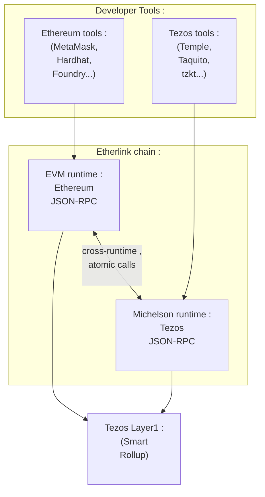
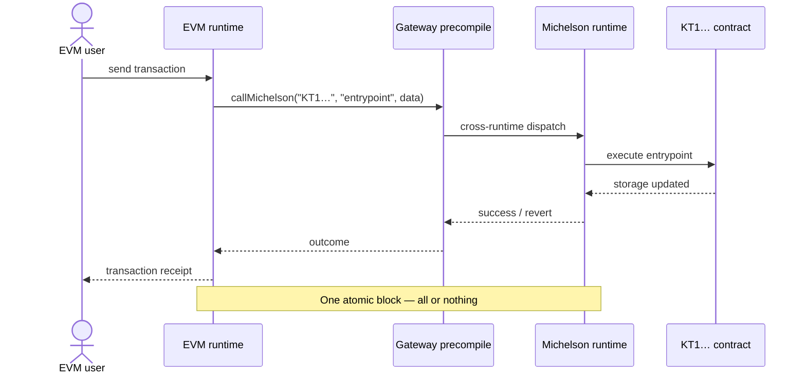

# Etherlink's architecture

## Seamless integration

To enable the seamless integration of the two ecosystems (EVM and Michelson) in a single blockchain, Etherlink<!--TX--> provides **Native Atomic Composability** (sometimes shortened as NAC): smart contracts in one interface can call contracts in the other within a single atomic transaction.
Thanks to the atomic composition combined with the use of the same native token, Etherlink<!--TX--> can be seen as **unified execution layer**, constituting a single economical space.

Each interface is implemented by a dedicated runtime exposing a standard RPC endpoint.

| Interface | Runtime | RPC standard |
|---|---|---|
| EVM | EVM runtime | Ethereum JSON-RPC |
| Michelson | Michelson runtime | Tezos RPC |

The goal for each interface is to stay as compatible as possible with the original ecosystem it supports — Ethereum for the EVM interface, and Tezos Layer 1 for the Michelson interface. Where differences exist, they are documented in the respective interface sections.

### Bridging vs. NAC

When an EVM contract calls a Michelson contract on Etherlink<!--TX-->, both execution steps happen inside the same rollup kernel, within a single block:

This is fundamentally different from **L1↔L2 bridging** (moving assets between Tezos L1 and Etherlink<!--TX-->) or **cross-chain bridging** (connecting two independent chains through a third-party relayer).
In both bridging cases, the two sides are separate ledgers that must be reconciled across transactions.

| | L1↔L2 bridge | Cross-chain bridge | NAC (intra-Etherlink<!--TX-->) |
|---|---|---|---|
| Chains / layers involved | 2 | 3+ | 1 |
| Number of transactions | 2+ | 4+ | 1 |
| Atomic (all-or-nothing) | No | No | Yes — reverts entirely |
| Latency | Minutes to hours | Minutes to hours | Same block (~500 ms) |
| Asset representation | Wrapped tokens | Doubly-wrapped tokens | Native tokens |
| Trust assumption | Bridge operator | Multiple bridge operators | None — same kernel |

### NAC call sequence

The diagram below shows what happens inside a single block when an EVM contract calls a Michelson contract through the gateway precompile.

Because the two runtimes share the same ledger, there are no wrapped tokens to mint or burn, no bridge relayer to trust, and no risk of one side completing while the other fails.

## Network architecture

Etherlink<!--TX--> is powered by a [Tezos Smart Rollup](https://docs.tezos.com/architecture/smart-rollups). The key components of the [Etherlink<!--TX--> architecture](/network/architecture) are:

- **Sequencer** — elected by Tezos Layer 1 bakers, the sequencer orders and batches operations from all interfaces into _blueprints_, which it publishes to the L1 rollup inbox. It targets a block time of around 500 ms, and offers pre-confirmations in about 50ms.
- **Rollup nodes** — apply blueprints (including operations from all interfaces) to produce Etherlink<!--TX--> blocks and maintain the chain state. Each rollup node derives a per-interface block from each Etherlink<!--TX--> block.
- **EVM nodes<!--TXN-->** — expose the two JSON-RPC APIs, backed respectively by the EVM runtime state and Michelson runtime state.
  Thus, they could be called "Etherlink nodes" by now, but we keep calling them "EVM nodes" because the corresponding executable is still called `octez-evm-node`.
- **Tezos nodes** — expose the Tezos Layer 1 RPC API.

Operations submitted via either interface to the corresponding runtime are collected by the sequencer, interleaved in first-in-first-out order, and included in the next blueprint.
